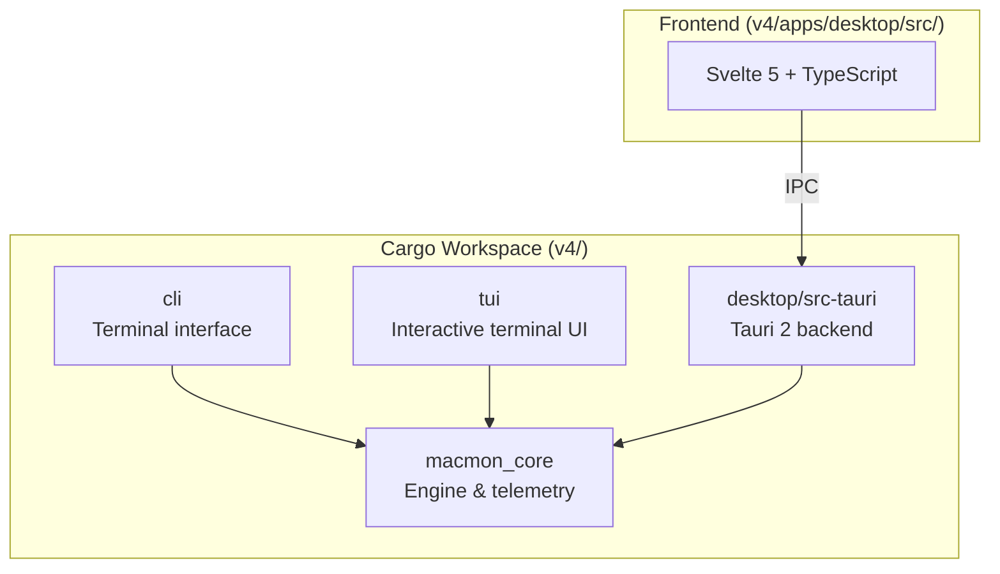
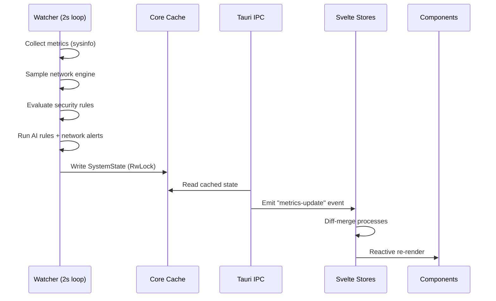
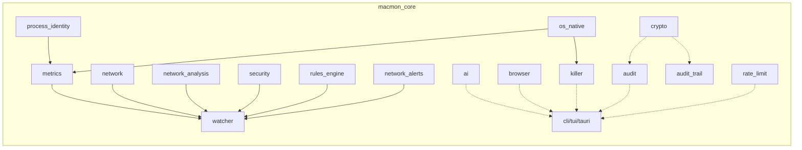
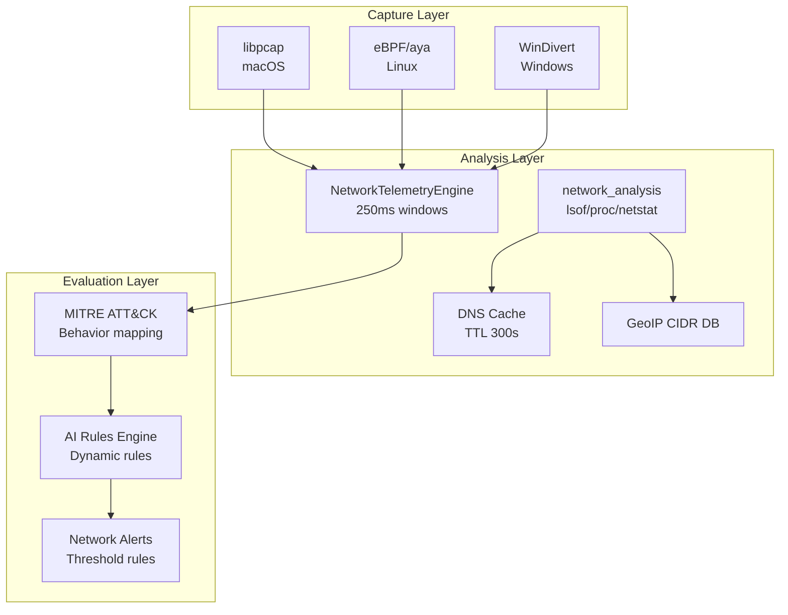
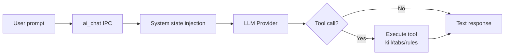
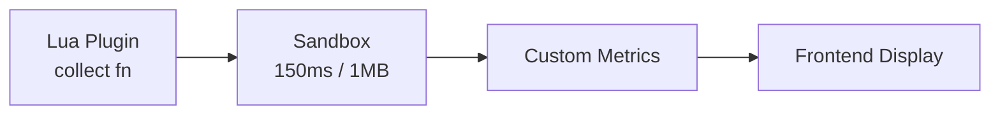
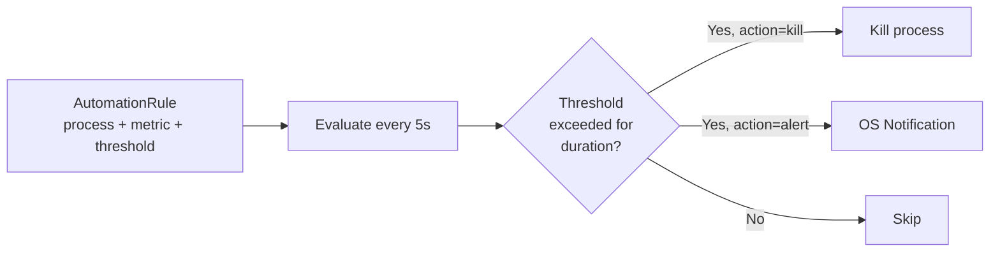
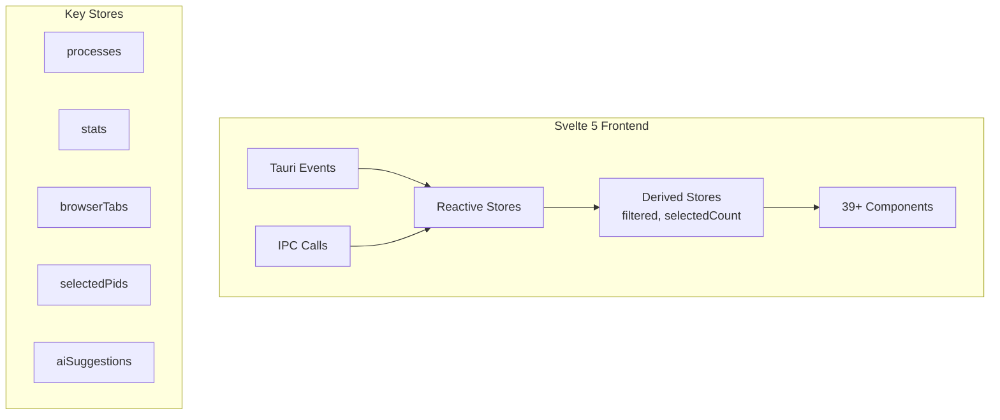

# OmniMon Architecture

Version: 6.3.0

This document describes the high-level architecture of OmniMon, covering the Cargo workspace layout, data flow, key subsystems, and security design.

## Workspace Layout

OmniMon is organized as a Cargo workspace with four crates plus a Svelte frontend:

| Crate | Path | Purpose |
|-------|------|---------|
| `macmon_core` | `crates/core/` | All native monitoring logic: metrics, network, AI, security, crypto |
| `cli` | `crates/cli/` | Binary with 17+ subcommands (clap) |
| `tui` | `crates/tui/` | Interactive terminal dashboard (ratatui + crossterm) |
| `desktop` | `apps/desktop/src-tauri/` | Tauri 2 backend: IPC commands, automations, plugins |
| Frontend | `apps/desktop/src/` | Svelte 5 components, stores, and TypeScript types |

## Data Flow

### Watcher Loop (every 2 seconds)

The background watcher thread (`core::watcher`) is the heartbeat of OmniMon:

1. **Sample network engine** — Capture packets via native backend (250ms windows)
2. **Evaluate security observations** — Map network events to MITRE ATT&CK techniques
3. **Collect system state** — Memory, CPU, swap via `sysinfo` + native FFI
4. **Aggregate processes** — Group by binary identity (bundle ID, exec name)
5. **Network analysis** (every 6 seconds) — Full connection snapshot via lsof/proc/netstat
6. **Evaluate AI rules** — Match against dynamic rule set
7. **Evaluate network alert rules** — Check bandwidth, ports, spikes
8. **Build security heartbeat** — NIST-compliant status
9. **Write to cache** — `RwLock<SystemState>` for zero-copy reads

**Performance:** Pre-allocated buffers are reused across ticks (zero-allocation hot path). Network engine runs in a separate thread with 250ms capture windows.

## Core Modules

| Module | LOC | Responsibility |
|--------|-----|---------------|
| `ai` | 2,300+ | Multi-provider LLM integration (OpenAI, Anthropic, Gemini, OpenRouter, Ollama). Tool calling, prompt injection detection, response caching |
| `network_analysis` | 2,600+ | Cross-platform connection capture (lsof/proc/netstat), DNS caching, per-process summaries, snapshot history |
| `network` | 1,200+ | Packet capture engine: eBPF (Linux), libpcap (macOS), WinDivert (Windows). Per-process throughput |
| `browser` | 1,000 | Chrome DevTools Protocol + AppleScript for tab management across 6 browsers |
| `crypto` | 800+ | AES-256-GCM encryption, Ed25519 signing, SHA-256 hashing, HKDF key derivation |
| `rules_engine` | 700 | AI-driven dynamic rules: GeoIP CIDR, temporal correlation, process memory thresholds |
| `killer` | 580 | Safe process termination with immutable OS-specific blocklists |
| `watcher` | 500 | Background monitoring daemon with 2-second interval |
| `metrics` | 440 | Process telemetry: CPU, memory, disk I/O, energy impact scoring |
| `security` | 300 | MITRE ATT&CK behavior mapping, network policy enforcement |
| `audit` | 280 | CVE matching against local databases, NIST heartbeat generation |
| `rate_limit` | 220 | Token bucket rate limiter for IPC protection |
| `os_native` | 210 | Platform FFI: vm_stat (macOS), Win32 (Windows), libc (Linux) |

## Network Architecture

**Capture backends** are auto-detected per platform. The engine falls back to `sysinfo` network data when native capture is unavailable.

**Network alert types:** `high_bandwidth`, `new_external_connection`, `unusual_port`, `process_network_spike`, `connection_count_exceeded`, `suspicious_destination`.

## AI Integration

**Supported providers:** OpenAI, Anthropic, Gemini, OpenRouter, Ollama (local).

**Tool calling:** The AI can execute `kill_process`, `kill_by_name`, `close_tabs`, `add_automation_rule`, `remove_automation_rule` — all gated by confirmation in the frontend.

**Security:** Prompt injection detection via `check_prompt_injection()`. API keys stored in native OS keyrings (never in plain text). Rate limited with token bucket.

## Plugin System

Plugins are Lua scripts with a `collect(ctx)` entry point. Each plugin runs in a sandboxed environment with:
- **150ms** execution timeout
- **1MB** memory limit
- **64** max metrics per plugin
- **32** max plugins total

Managed via IPC: `install_plugin`, `list_plugins`, `set_plugin_enabled`, `remove_plugin`.

## Automations Engine

Rules define: `process_pattern`, `metric` (cpu/ram), `threshold`, `duration_secs`, `action` (kill/alert). Persisted in `automations.json`.

## Tauri IPC Bridge

The frontend communicates with Rust through Tauri's IPC bus. All commands are defined in `apps/desktop/src-tauri/src/lib.rs`.

**Rate limiting profiles:**

| Profile | Capacity | Refill/sec | Commands |
|---------|----------|-----------|----------|
| KILL | 10 | 5.0 | `kill_process`, `kill_processes` |
| AI | 10 | 2.0 | `validate_api_key`, `analyze_*`, `ai_chat` |
| BROWSER | 30 | 10.0 | `close_browser_tab`, `focus_browser_tab` |
| CONFIG | 5 | 2.0 | `save_ai_config`, `apply_ai_rules`, `add_automation_rule`, plugin ops |

**Emitted events:**

| Event | Interval | Payload |
|-------|----------|---------|
| `metrics-update` | 2s | Full metrics snapshot |
| `network-update` | 5s | Network analysis snapshot |
| `security-alert` | 900ms (deduped) | Dynamic rule alerts |
| `network-alert` | 900ms (deduped) | Network threshold alerts |

## Frontend Architecture

**Store pattern:** Writable stores for raw data, derived stores for computed views. Diff-based updates minimize re-renders.

**Virtual scrolling:** The process table renders 2000+ processes at 60 FPS using windowed rendering.

**User profiles:** Three presets (minimal/balanced/power) control dashboard section visibility, refresh intervals, and notification levels. Favorite processes are pinned to the top of the process table.

**i18n:** Internationalization support via locale files (EN/ES).

## Testing Architecture

**Unit tests (1083 total):**
- Frontend: 663 tests via Vitest + Testing Library (45 test files)
- Rust core: 367 tests (inline `#[cfg(test)]`)
- Rust desktop: 46 tests (plugins, automations)
- Coverage: 86.5% statements, 72% branches, 87.7% functions

**E2E tests (7 total):**
- Framework: Playwright (standalone, no Tauri WebDriver)
- 5 suites: app-loads, process-table, navigation, settings, ai-chat
- Fixtures mock Tauri IPC (metrics, tabs, network, AI)

## Security Design

### Credential Storage
All API keys and secrets are stored in native OS keyrings:
- **macOS:** Keychain
- **Windows:** Credential Manager
- **Linux:** Secret Service (libsecret)

### Process Protection
Immutable blocklists prevent killing critical OS processes (`launchd`, `csrss.exe`, `systemd`, etc.). Path validation ensures only trusted OS directories are protected.

### Content Security Policy
Strict CSP in `tauri.conf.json`: only `self` plus explicitly allowed LLM API domains.

### Cryptographic Operations
- **AES-256-GCM:** Encryption for security reports and audit trails
- **Ed25519:** Digital signatures for release binaries
- **SHA-256:** Integrity checksums
- **HKDF:** Key derivation

### IPC Security
- Runtime type validation on all IPC responses (`ipc.ts`)
- Rate limiting on all sensitive commands
- Input sanitization for tab IDs, URLs, and AI payloads
- Prompt injection detection in AI chat

### AppleScript RCE Mitigation
OmniMon avoids string interpolation of user data into AppleScript. Arguments are passed as positional parameters via `on run argv`, preventing injection attacks.

### CDP WebSocket Validation
Tab IDs from the frontend are validated before constructing WebSocket URLs. Characters like `/`, `\`, `?`, and `#` are rejected to prevent path traversal.

## Release & Distribution

| Platform | Format | Channel |
|----------|--------|---------|
| macOS | .dmg, Homebrew | `brew tap chochy2001/omnimon` |
| Windows | .msi | GitHub Releases |
| Linux | .deb, .rpm, .AppImage | GitHub Releases + install script |
| Auto-update | CrabNebula CDN | Ed25519 signed |

**Release profile:** LTO enabled, single codegen unit, panic=abort, stripped symbols, size-optimized (`opt-level = "z"`).

**CI/CD:** GitHub Actions matrix (Ubuntu, macOS, Windows). Coverage minimum: 85% (Linux).
